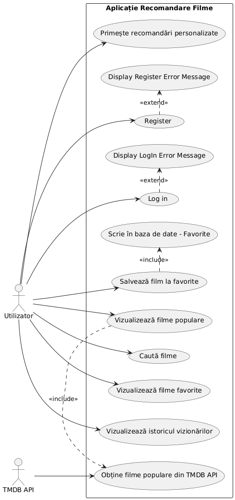

# proiect-MDS

## Metode de Dezvoltare Software (2024-2025)

## Table of contents
- [Descriere proiect](#descriere-proiect)
- [Members](#members)
- [Backlog](#backlog)
- [Diagrama UML (Use Case)](#diagrama-uml-use-case)

## Descriere proiect
Acest proiect reprezintă un sistem de recomandare de filme, care permite utilizatorilor să vizualizeze filme populare în timp real (prin integrarea cu API-ul TMDB), să salveze filme favorite și să primească recomandări personalizate pe baza istoricului de vizionare și a filmelor salvate.  
Sistemul oferă, de asemenea, funcționalități de autentificare și gestionare a utilizatorilor.

## Members:
- Copilău Andrei
- Florea Mihai-Alexandru
- Vasile Radu-Mihai

## Backlog:
[Link catre backlog](https://copilauandrei.atlassian.net/jira/software/projects/KAN/boards/1?assignee=unassigned)

## Diagrama UML (Use Case)

